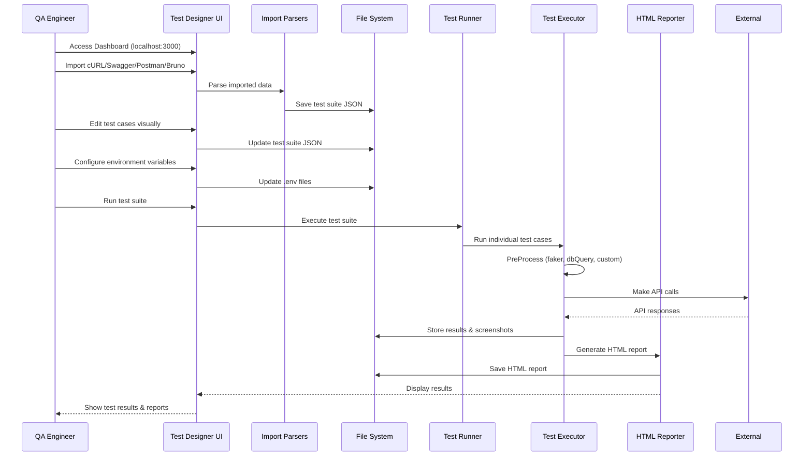
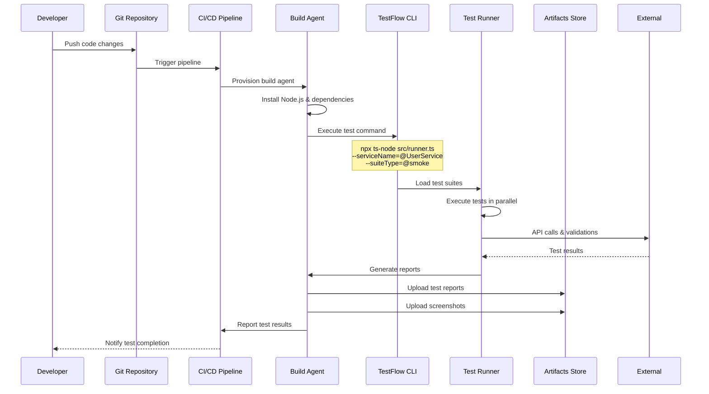
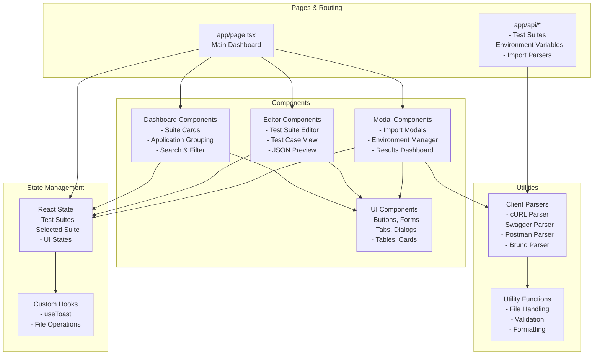
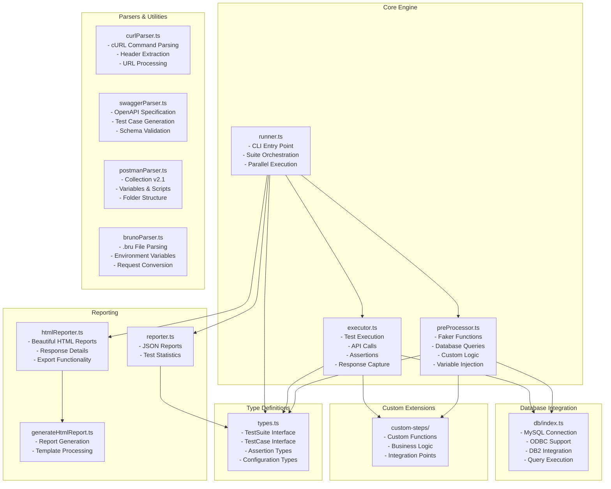
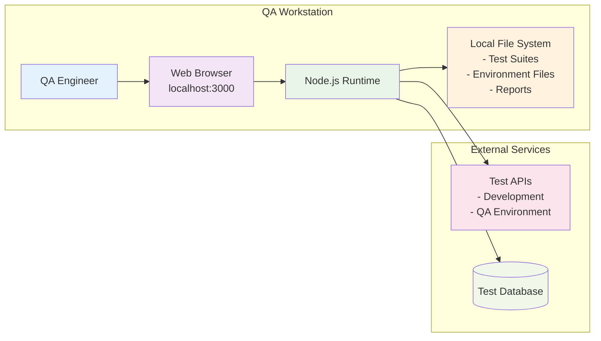
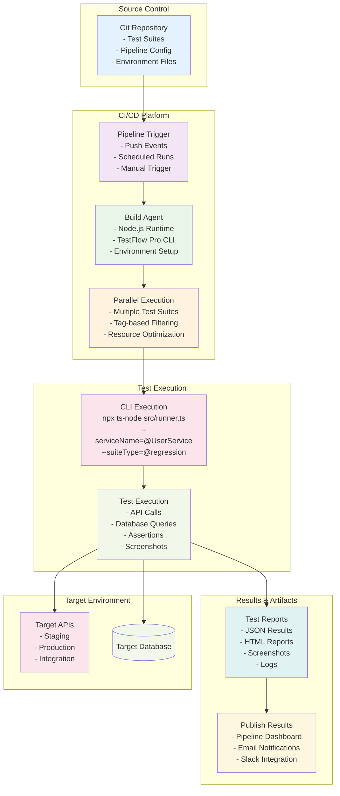

# TestFlow Pro - Architecture Diagram

## 🏗️ System Architecture Overview

```mermaid
graph TB
    subgraph "Local Development Environment"
        subgraph "Frontend UI (React/Next.js)"
            UI[Test Designer UI<br/>Port: 3000]
            DASH[Dashboard<br/>- Suite Management<br/>- Application Grouping<br/>- Grid/List Views]
            EDITOR[Visual Editor<br/>- Test Case Creation<br/>- JSON Preview<br/>- Validation]
            IMPORT[Import Modules<br/>- cURL Parser<br/>- Swagger/OpenAPI<br/>- Postman Collections<br/>- Bruno Collections]
            ENV[Environment Manager<br/>- .env File Editor<br/>- Multi-Environment<br/>- Variable CRUD]
            RESULTS[Results Dashboard<br/>- HTML Reports<br/>- Test Details<br/>- Response Capture]
        end
        
        subgraph "Backend Core (TypeScript/Node.js)"
            RUNNER[Test Runner<br/>src/runner.ts]
            EXECUTOR[Test Executor<br/>src/executor.ts]
            PREPROC[PreProcessor<br/>src/preProcessor.ts]
            REPORTER[HTML Reporter<br/>src/htmlReporter.ts]
            PARSER[Parsers<br/>- cURL Parser<br/>- Swagger Parser<br/>- Postman Parser<br/>- Bruno Parser]
        end
        
        subgraph "File System"
            TESTDATA[Test Suites<br/>testData/*.json]
            ENVFILES[Environment Files<br/>.env.dev<br/>.env.qa<br/>.env.prod]
            REPORTS[Reports<br/>reports/*.json<br/>reports/*.html]
            SCREENSHOTS[Screenshots<br/>screenshots/*.png]
        end
        
        subgraph "External Integrations"
            DB[(Database<br/>MySQL/ODBC/DB2)]
            APIS[External APIs<br/>REST/SOAP/GraphQL]
            BROWSER[Browser<br/>Playwright/Selenium]
        end
    end
    
    subgraph "CI/CD Pipeline Environment"
        subgraph "Azure DevOps"
            ADO_PIPELINE[Azure Pipeline<br/>azure-pipelines.yml]
            ADO_AGENT[Build Agent<br/>- Node.js Runtime<br/>- TestFlow Pro CLI]
            ADO_ARTIFACTS[Pipeline Artifacts<br/>- Test Reports<br/>- Screenshots<br/>- Logs]
        end
        
        subgraph "GitHub Actions"
            GH_WORKFLOW[GitHub Workflow<br/>.github/workflows/test.yml]
            GH_RUNNER[GitHub Runner<br/>- Node.js Runtime<br/>- TestFlow Pro CLI]
            GH_ARTIFACTS[Action Artifacts<br/>- Test Reports<br/>- Screenshots<br/>- Logs]
        end
        
        subgraph "Jenkins"
            JENKINS_JOB[Jenkins Job<br/>Jenkinsfile]
            JENKINS_AGENT[Jenkins Agent<br/>- Node.js Runtime<br/>- TestFlow Pro CLI]
            JENKINS_ARTIFACTS[Build Artifacts<br/>- Test Reports<br/>- Screenshots<br/>- Logs]
        end
    end
    
    subgraph "Shared Components"
        CLI[Command Line Interface<br/>npx ts-node src/runner.ts<br/>--serviceName=@UserService<br/>--suiteType=@smoke]
        CONFIG[Configuration<br/>- Environment Variables<br/>- Database Connections<br/>- API Endpoints<br/>- Parallel Execution]
    end
    
    %% Local Environment Connections
    UI --> DASH
    UI --> EDITOR
    UI --> IMPORT
    UI --> ENV
    UI --> RESULTS
    
    DASH --> TESTDATA
    EDITOR --> TESTDATA
    IMPORT --> PARSER
    ENV --> ENVFILES
    RESULTS --> REPORTS
    
    PARSER --> TESTDATA
    RUNNER --> EXECUTOR
    RUNNER --> PREPROC
    RUNNER --> REPORTER
    RUNNER --> CLI
    
    EXECUTOR --> DB
    EXECUTOR --> APIS
    EXECUTOR --> BROWSER
    EXECUTOR --> REPORTS
    EXECUTOR --> SCREENSHOTS
    
    PREPROC --> DB
    PREPROC --> ENVFILES
    
    REPORTER --> REPORTS
    
    %% CI/CD Environment Connections
    ADO_PIPELINE --> ADO_AGENT
    ADO_AGENT --> CLI
    ADO_AGENT --> CONFIG
    ADO_AGENT --> ADO_ARTIFACTS
    
    GH_WORKFLOW --> GH_RUNNER
    GH_RUNNER --> CLI
    GH_RUNNER --> CONFIG
    GH_RUNNER --> GH_ARTIFACTS
    
    JENKINS_JOB --> JENKINS_AGENT
    JENKINS_AGENT --> CLI
    JENKINS_AGENT --> CONFIG
    JENKINS_AGENT --> JENKINS_ARTIFACTS
    
    CLI --> RUNNER
    CONFIG --> ENVFILES
    
    %% Styling
    classDef frontend fill:#e1f5fe,stroke:#01579b,stroke-width:2px
    classDef backend fill:#f3e5f5,stroke:#4a148c,stroke-width:2px
    classDef storage fill:#e8f5e8,stroke:#1b5e20,stroke-width:2px
    classDef external fill:#fff3e0,stroke:#e65100,stroke-width:2px
    classDef cicd fill:#fce4ec,stroke:#880e4f,stroke-width:2px
    classDef shared fill:#f1f8e9,stroke:#33691e,stroke-width:2px
    
    class UI,DASH,EDITOR,IMPORT,ENV,RESULTS frontend
    class RUNNER,EXECUTOR,PREPROC,REPORTER,PARSER backend
    class TESTDATA,ENVFILES,REPORTS,SCREENSHOTS storage
    class DB,APIS,BROWSER external
    class ADO_PIPELINE,ADO_AGENT,ADO_ARTIFACTS,GH_WORKFLOW,GH_RUNNER,GH_ARTIFACTS,JENKINS_JOB,JENKINS_AGENT,JENKINS_ARTIFACTS cicd
    class CLI,CONFIG shared
```

## 🔄 Data Flow Diagrams

### Local Development Workflow

### CI/CD Pipeline Workflow

## 🏛️ Component Architecture

### Frontend Architecture (React/Next.js)

### Backend Architecture (Node.js/TypeScript)

## 🚀 Deployment Scenarios

### Scenario 1: Local QA Testing

### Scenario 2: CI/CD Pipeline Integration

## 📋 Technology Stack

### Frontend Stack
- **Framework**: React 18 with Next.js 14
- **Styling**: Tailwind CSS with custom slate theme
- **Components**: Radix UI primitives
- **State Management**: React hooks and context
- **Build Tool**: Next.js with TypeScript

### Backend Stack
- **Runtime**: Node.js with TypeScript
- **Testing Engine**: Custom test executor
- **Database**: MySQL, ODBC, DB2 support
- **Browser Automation**: Playwright integration
- **Reporting**: Custom HTML/JSON reporters

### DevOps & CI/CD
- **Version Control**: Git (GitHub, Azure DevOps)
- **CI/CD Platforms**: Azure Pipelines, GitHub Actions, Jenkins
- **Package Management**: npm with package-lock.json
- **Environment Management**: .env files with multi-environment support

### External Integrations
- **API Testing**: REST, SOAP, GraphQL support
- **Import Formats**: cURL, Swagger/OpenAPI, Postman v2.1, Bruno collections
- **Database Connectivity**: MySQL, ODBC, DB2 drivers
- **Reporting**: HTML export with professional styling

This architecture provides a comprehensive view of TestFlow Pro's structure, supporting both local development workflows and enterprise CI/CD pipeline integration.